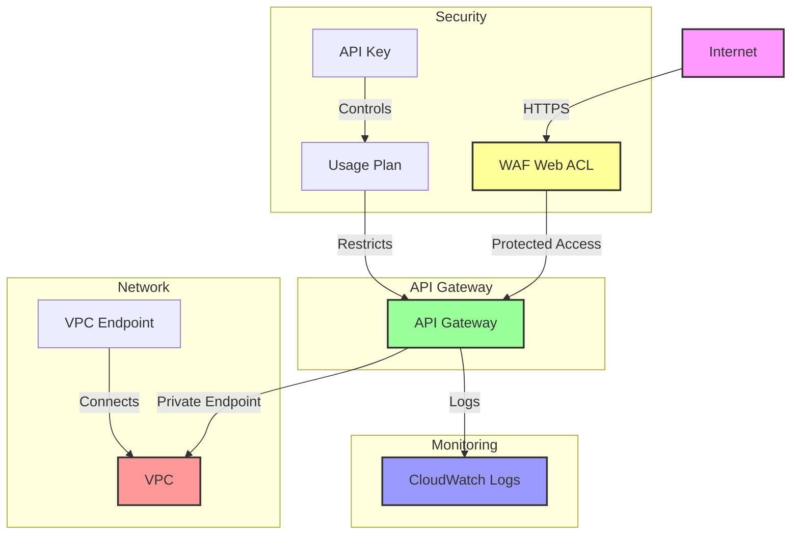

# Infrastructure Cloud Diagram

## Components Description

1. **WAF (Web Application Firewall)**
   - Protects API Gateway with AWS managed rules
   - Named: `{project_name}-waf`

2. **API Gateway**
   - Secure REST API implementation
   - Named: `{project_name}-api`
   - Protected by WAF
   - Logs to CloudWatch

3. **Security**
   - API Key authentication
   - Usage plan for API access control
   - IAM policies for resource access

4. **Networking**
   - VPC Endpoint for private API access
   - Security group controls for endpoint access

5. **Monitoring**
   - CloudWatch log group for API logs
   - Access logging enabled

The infrastructure follows AWS best practices with:
- Secure private networking via VPC endpoints
- WAF protection for API endpoints
- API key authentication
- Comprehensive logging
- Usage plan for API consumption control